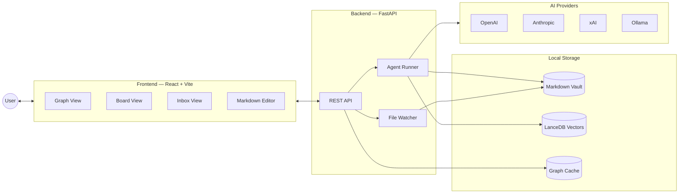
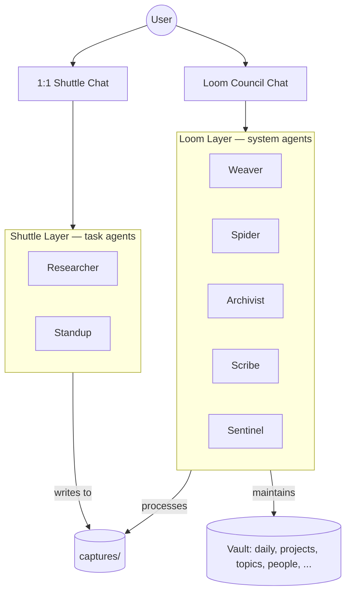
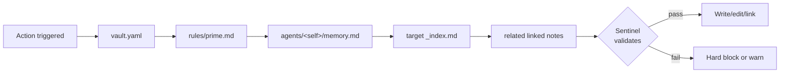
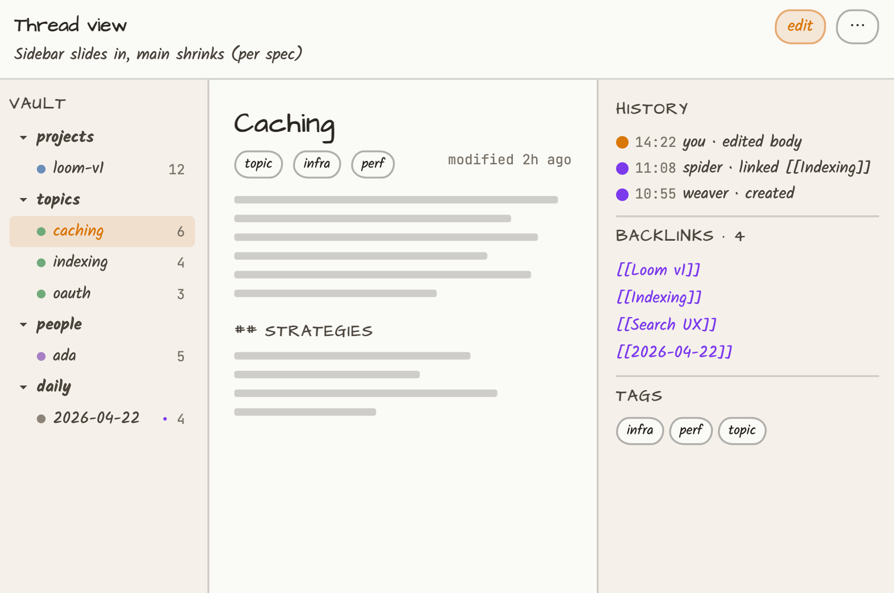

<p align="center">
  
</p>

<p align="center">
  A local-first AI memory system with a multi-agent backbone and a visual knowledge graph.
</p>
```
  ,,
`7MM
  MM
  MM  ,pW"Wq.   ,pW"Wq.`7MMpMMMb.pMMMb.
  MM 6W'   `Wb 6W'   `Wb MM    MM    MM
  MM 8M     M8 8M     M8 MM    MM    MM
  MM YA.   ,A9 YA.   ,A9 MM    MM    MM
.JMML.`Ybmd9'   `Ybmd9'.JMML  JMML  JMML.
```

**A local-first AI memory system with a multi-agent backbone and a visual knowledge graph.**


---

## What is Loom?

Loom is a personal knowledge system that stores everything as **plain Markdown** on your disk and uses a **team of AI agents** to keep it organized. Notes connect via `[[wikilinks]]`, and a **force-directed graph** lets you see your mind at a glance.

You write captures; agents do the structuring, linking, summarizing, and validating. The whole stack runs locally — your files, your provider keys, your machine.

## Why Loom?

- **Local-first.** Notes live as readable Markdown in `~/.loom/vaults/`. No lock-in, no cloud sync, no proprietary database.
- **Multi-agent, not single-prompt.** Seven specialized agents in two tiers (Loom Layer manages the vault; Shuttle Layer produces content) collaborate via a shared *read-before-write* discipline.
- **Visual by default.** A `react-force-graph-2d` canvas shows your notes as a living network — drag, zoom, filter by type or tag.
- **Provider-agnostic.** Plug in OpenAI, Anthropic, xAI, or a local Ollama model. Chat and embedding providers are independent.

## Architecture at a glance



The backend reads and writes the vault on disk; the frontend renders it. The agent runner orchestrates AI calls; the file watcher keeps the index fresh when notes change outside the UI.

## The two-tier agent system



**Loom Layer** agents manage the vault. You speak to them collectively via the **Loom Council** — a transparent multi-agent thread where each one chimes in by role.

**Shuttle Layer** agents are task-driven; you chat with them one-on-one. They never write into the main vault — they drop output into `captures/`, and the Loom Layer takes it from there.

### Agent reference

| Agent | Tier | Role |
|---|---|---|
| **Weaver** | Loom | Converts raw captures into structured notes with YAML frontmatter. |
| **Spider** | Loom | Finds semantic connections and maintains bidirectional `[[wikilinks]]`. |
| **Archivist** | Loom | Audits the vault — flags stale notes, broken links, missing metadata. |
| **Scribe** | Loom | Writes folder `_index.md` files and daily logs. |
| **Sentinel** | Loom | Validates every agent action against `prime.md` rules and schemas. |
| **Researcher** | Shuttle | Answers questions by searching the vault and citing source notes. |
| **Standup** | Shuttle | Generates a daily activity recap from changelogs and modified notes. |

## Read-before-write

Every agent follows the same chain before performing any mutation. This keeps the vault internally consistent and gives `prime.md` (your constitution) real authority.



Hard block on failure by default; trusted agents can be configured for soft-warn.

## Features

### Knowledge graph
- Force-directed `react-force-graph-2d` layout with drag, zoom, pan
- Hover highlights neighbors; edge thickness scales with link density
- Filter by note type or tag; click-to-select syncs with the file tree
- ETags + `Last-Modified` for cheap refresh

### Vault & notes
- Multi-vault filesystem at `~/.loom/vaults/`
- Fixed core folders (`daily`, `projects`, `topics`, `people`, `captures`) plus your own
- Atomic Markdown writes with YAML frontmatter (`id`, `title`, `type`, `tags`, `created`, `modified`, `author`, `status`, `history`)
- Edit history tracked per-mutation in frontmatter
- Deletion = move to `.archive/`, never destroyed
- File watcher reflects external edits live

### Search
- Hybrid: semantic (LanceDB vectors) + keyword + tag/type filters
- Graph-aware boosting — linked notes rank higher
- Keyword fallback when no embedding provider is configured
- Global search bar (Cmd/Ctrl+K) plus a separate file-tree filter

### Agents & chat
- Per-agent `memory.md` summarized every 20 actions
- Per-agent-per-day changelog at `.loom/changelog/<agent>/<date>.md`
- Chat history persisted as Markdown: `agents/_council/chat/` for Council, `agents/<name>/chat/` for Shuttle
- Captures inbox view for triaging raw input before Weaver structures it

### Providers
- OpenAI (chat + embed)
- Anthropic (chat + embed)
- xAI / Grok (chat)
- Ollama (local chat + embed)
- Chat and embedding providers configured independently

## Tech stack

| Layer | Tools |
|---|---|
| Backend | Python 3.11+, FastAPI, Pydantic v2, Uvicorn |
| Frontend | React 19, TypeScript 5.9, Vite |
| Graph | `react-force-graph-2d` |
| Editor | `react-markdown` + textarea, `@udecode/plate` (optional rich mode) |
| Vector DB | LanceDB + PyArrow |
| AI | OpenAI / Anthropic SDKs, `httpx` for xAI / Ollama |
| File sync | `watchdog` |
| Rate limit | `slowapi` |
| Tests | `pytest` + `pytest-asyncio` (backend), `vitest` + Testing Library (frontend) |
| Lint/format | `ruff` (Python), ESLint + Prettier (TS) |

## Quick start

### Prerequisites
- Python ≥ 3.11
- Node.js ≥ 18 with npm
- An API key for at least one provider (or a running Ollama instance)

### Backend
```bash
cd backend
pip install -e ".[dev]" --break-system-packages
uvicorn api.main:app --reload --port 8000
```

### Frontend
```bash
cd frontend
npm install
npm run dev   # serves on http://localhost:5173
```

Open the frontend, then go to **Settings → Providers** to add an API key. The backend reads `~/.loom/config.yaml` for global config and creates a default vault at `~/.loom/vaults/default` on first run.

### Seed an example vault
```bash
# Copy the demo vault to your local Loom directory
cp -r examples/demo-vault ~/.loom/vaults/demo
```

Then switch to it from **Settings → General → Active vault**.

## Configuration

Global config lives at `~/.loom/config.yaml`:

```yaml
active_vault: default
providers:
  default: openai
  openai:
    api_key: ${OPENAI_API_KEY}
    embed_model: text-embedding-3-small
    chat_model: gpt-4o
  anthropic:
    api_key: ${ANTHROPIC_API_KEY}
    chat_model: claude-sonnet-4-20250514
  ollama:
    host: http://localhost:11434
    embed_model: nomic-embed-text
    chat_model: llama3
```

Per-vault config lives at `~/.loom/vaults/<name>/vault.yaml` (custom folders, agent overrides, etc).

## Project structure

```
Loom/
├── backend/
│   ├── api/              # FastAPI routers (notes, graph, search, chat, ...)
│   ├── agents/
│   │   ├── loom/         # Weaver, Spider, Archivist, Scribe, Sentinel
│   │   └── shuttle/      # Researcher, Standup
│   ├── core/             # vault, notes, config, watcher, providers, exceptions
│   ├── index/            # LanceDB indexer, searcher, chunker
│   └── tests/
├── frontend/
│   ├── src/
│   │   ├── views/        # GraphView, BoardView, InboxView
│   │   ├── components/   # FileTree, Sidebar, SearchDropdown, SettingsModal, ...
│   │   └── lib/          # api/, context/, editor/, useTheme
│   └── public/
├── docs/                 # architecture-ref.md, style-guide.md
├── examples/
│   └── demo-vault/       # ready-to-use sample vault
├── scripts/              # seed and utility scripts
└── .github/workflows/    # CI
```

## API surface

The backend exposes a REST API on `:8000`. The most-used endpoints:

| Method | Endpoint | Purpose |
|---|---|---|
| `GET` | `/api/graph` | Fetch the force-directed graph (supports ETag caching) |
| `GET` | `/api/tree` | File tree |
| `GET` `POST` `PUT` `DELETE` | `/api/notes` | Note CRUD (delete = archive) |
| `GET` | `/api/search?q=...` | Hybrid search |
| `GET` `POST` | `/api/captures` | List & process captures (single or batch) |
| `GET` | `/api/agents` | Agent status + action counts |
| `GET` | `/api/agents/{name}/changelog` | Agent changelog |
| `POST` | `/api/chat/send` | Talk to a Shuttle agent or the Council |
| `GET` `POST` `PUT` | `/api/vaults` | Multi-vault management |
| `GET` `POST` | `/api/settings/providers` | Provider config (keys masked on read) |
| `GET` | `/api/health` / `/api/ready` | Health + readiness probes |

## Development

```bash
# Backend
ruff check backend/
ruff format backend/
pytest backend/tests/

# Frontend
cd frontend
npm run lint
npm run format
npm run test
```

CI runs on push via `.github/workflows/ci.yml`.

## Status

In active development. What works today:

- All 5 Loom Layer agents (Weaver, Spider, Archivist, Scribe, Sentinel)
- Both Shuttle Layer agents (Researcher, Standup)
- Graph, Board, and Inbox views
- Multi-vault management
- Hybrid semantic + keyword search with graph-aware boosting
- Provider system (OpenAI, Anthropic, xAI, Ollama)
- File watcher, rate limiting, health/readiness probes

In flight:
- Scribe's daily-log generation (index works; daily summary being tuned)
- Sentinel's full AI-assisted validation
- Standup calendar integration

See [`docs/architecture-ref.md`](docs/architecture-ref.md) for the full design and [`docs/style-guide.md`](docs/style-guide.md) for conventions.

## License

### Wireframes

Early sketches of the visual language and view models. These are *wireframes, not the final UI* — the real product renders in ink-blue + brick-red duotone on warm cream paper, with serif typography from the design language.

<p align="center">
  
</p>

#### Views

<table>
  <tr>
    <td align="center" width="50%">
      <br />
      <sub><b>Graph</b> — constellation map with type-colored nodes, hub sizing, hover-highlighted neighborhoods</sub>
    </td>
    <td align="center" width="50%">
      <br />
      <sub><b>Orbit</b> — focus-first concentric rings around a selected note</sub>
    </td>
  </tr>
  <tr>
    <td align="center">
      <br />
      <sub><b>Thread</b> — serif-led note reader with edit history, backlinks, and local graph</sub>
    </td>
    <td align="center">
      <br />
      <sub><b>Editor</b> — split source/preview writing experience with wikilink autocomplete</sub>
    </td>
  </tr>
  <tr>
    <td align="center">
      <br />
      <sub><b>Inbox</b> — capture-to-note flow with Weaver suggestions for type, folder, tags, and links</sub>
    </td>
    <td align="center">
      <br />
      <sub><b>Board</b> — agent presence: cards, round-table, and pulse modes with a live changelog</sub>
    </td>
  </tr>
  <tr>
    <td align="center">
      <br />
      <sub><b>Council</b> — transparent multi-agent thread where all five Loom Layer agents answer together</sub>
    </td>
    <td align="center">
      <br />
      <sub><b>Pulse</b> — live ECG-style heartbeats showing each agent's running / queued / idle state</sub>
    </td>
  </tr>
  <tr>
    <td align="center" colspan="2">
      <br />
      <sub><b>Search</b> — Cmd/Ctrl-K palette with hybrid semantic + keyword scoring across the vault</sub>
    </td>
  </tr>
</table>

---

More documentation coming soon.
